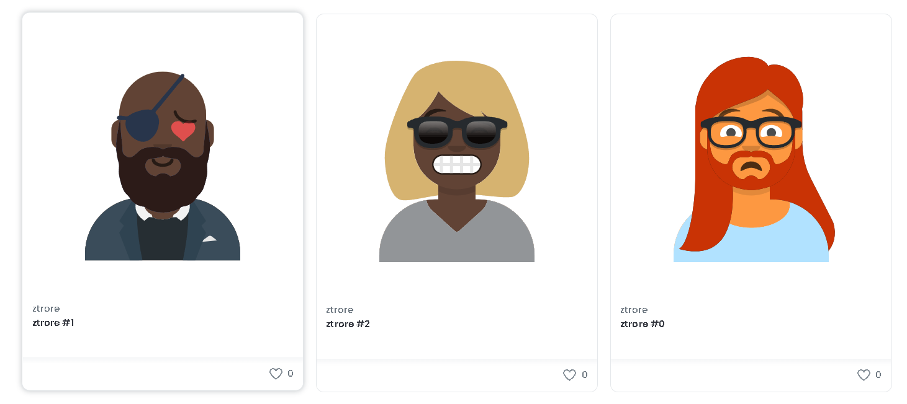

# ztrore

This project is separated in two repositories, one for the backend and other for the frontend. To navigate between the two repositories use these links:
- Frontend: [https://github.com/Jofay-zs/ztrore-front](https://github.com/Jofay-zs/ztrore-front)
- Backend: [https://github.com/Jofay-zs/ztrore](https://github.com/Jofay-zs/ztrore)

In this README.md you will find a documentation more focused on the backend.
- [Description](#description)
- [Tools and technologies used](#tools-and-technologies-used)
- [My path](#my-path)
- [Documentation](#documentation)

# Description
## What was the goal of the project ? 😀
Develop a DApp (Desentralized Application), where anyone could enter and could generate and obtain their NFT. Also encourage people to develop with web3 technologies.

## What does the project do ? 🏪
ztrore is a NFT marketplace compatible with the EIP 721 standar of Ethereum. Where you can generate and obtain an NFT. This are all the NFTs generated: [https://testnets.opensea.io/assets/ztrore](https://testnets.opensea.io/assets/ztrore)

## How and what was it build with ? 🥣
It was created with technologies and tools like: Solidity, Open Zeppelin, Hardhat, React, JS, Tailwind, a lot of documetation and videos. To see more about the tools and technologies [scroll down 🔽](#tools-and-technologies-used).

To see about my path [scroll down 🔽](#my-path)

## Technical difficulties ⚗️
The biggest problem I found was in smart contracts, due to my little knowledge on them. Also I have some difficulties writing the documentation, due to my regular English.

## Improvements for the future 🔮
I thought of two options for the future of this project.
1. Use other APIs to generate different NFTs, some examples of APIs that I found was, a kitten API generator, a Robot API generator and a Monster API generator.
2. Which personally I consider more difficult, but exciting, is re-create the entire app with assets created by me, and adding more metadata, to create more unique and different NFTs. Explore smart contracts more and use more features of the technologies that I used. Also I can implement chainlink so the generation of nft is not predictible.

# Tools and technologies used
- ## [Hardhat](https://hardhat.org/getting-started/)
    Hardhat is a development environment that allows us to compile, test and deploy smart contracts.

    Tips:
    - To run a script use: ```npx hardhat run scripts/scriptName```
    - To compile use: ```npx hardhat compile```
    - To test use: ```npx hardhat test```
    - To deploy use: ```npx hardhat run scripts/scriptName.js```

- ## [Solidity](https://docs.soliditylang.org/en/latest/)
    Solidity is an object-oriented, high-level language for implementing smart contracts. Smart contracts are programs which govern the behaviour of accounts within the Ethereum state.

    Solidity compiles on the EVM(Ethereum Virtual Machine)

- ## [Open Zeppelin](https://docs.openzeppelin.com/openzeppelin/)
    Since the smart contracts are standardized and do found management, the biggest concern is security. For this exist organizations like Open Zeppelin, which provide standar smart contracts, open source and previously audited. I used smart contracts and functions from Open Zeppelin like:
    - [ERC721](https://docs.openzeppelin.com/contracts/4.x/api/token/erc721#ERC721)
        Standard for NFTs, links to know more:
        - [link01](https://eips.ethereum.org/EIPS/eip-721)
        - [link02](https://github.com/ethereum/EIPs/issues/721)
    - [ERC721 Enumrable](https://docs.openzeppelin.com/contracts/4.x/api/token/erc721#ERC721Enumerable)
    - [Counters](https://docs.openzeppelin.com/contracts/4.x/api/utils#Counters)
    - [Strings utils](https://docs.openzeppelin.com/contracts/4.x/api/utils#Strings)

- ## Nodejs

- ## [Ethereum](https://ethereum.org/en/)

- ## [Infura](https://infura.io/)

- ## [Avatars Generator](https://getavataaars.com/)
    The API that I used to generate the NFTs
    

# My path
1. I review the technologies and tools that I was going to use in the whole project.
2. Install the necessary dependencies.
3. I create a repository for the backend with a generic code.
4. Develop ztrore smart contract.
5. Develop ztroreDNA smart contract.
6. Run tests.
7. Deploy and test it.
8. Generate and obtain NFTs from Etherscan.
9. Viewn my NFTs in OpenSea.

# Documentation
## Deploy
Your script and contract is not deployed to a central server, it is added to the blockchain through a transaction.

## EIP and ERC
An EIP or Ethereum Improvement Proposals are formal documents which contains improvement proposals for the Ethereum protocol. And ERC or Ethereum Request for Comments are preliminary proposals for the EIP.

## [Data URLs](https://developer.mozilla.org/en-US/docs/Web/HTTP/Basics_of_HTTP/Data_URIs)

## [Base64](https://developer.mozilla.org/en-US/docs/Glossary/Base64)
## ztroreDNA
With this DNA I can define the characteristics of the NFT.

From the DNA we are going to use the last 26 digits, each 2 digits will specify the value of each of the characteristics of the NFT, an example of this is that the last two digits defines the accessorie type, the penultimate two digits defines the color clothes and so moving on two digits to the left which each of our characteristics. If you want to know the exact position of a characteristic check [contracts/ztroreDNA.sol](contracts/ztroreDNA.sol)

Inside the ztroreDNA contract, you can find from lines 5 to 201 a list of arrays, each of these arrays contains the possible value for the characteristic, an example of this is the array _facialHairColor, which can have the value of Auburn, Black, Blonde, BlondeGolden, Brown, BrownDark, Platinum or Red.

Then we have from lines 218 to 294 a list of functions, one for each characteristic, each of these functions receives the parameter _dna, in this case, _dna is the wallet address from the person who is making the transaction. 
Once inside the function, we create a variable that contains the return value from the function [_getDNASection](#getdnasection), finally, from the characteristic assigned to the function, we return the value in the position of the rest of the division between the variable and the length of the characteristic array. This last calculation is to prevent if the dna section is bigger than the list of values in the characteristic.

### getDNASection
_getDNASection receives two parameters, first the _dna and second a number that we are going to call _discard. Inside this function the following logic is performed to return a part that iterests us, more specific two digits of the dna, that varies depending on the characteristic that we want to define.

The code that implements all the logic is this:
```
(_dna%(1*10**(_discard+2)))/(1*10**_discard)
```
We use _discard to discard the numbers that we don't need and depending on the discard number it's going to work like this:

| Discard value | Operation                                   | Part extracted |
| ------------- | ------------------------------------------- | -------------- |
| 0             | (...024890356123123788 % 100)/1             | 88             |
| 2             | (...024890356123123788 % 10000)/100         | 37             |
| 4             | (...024890356123123788 % 1000000)/10000     | 12             |
| 6             | (...024890356123123788 % 100000000)/1000000 | 23             |
